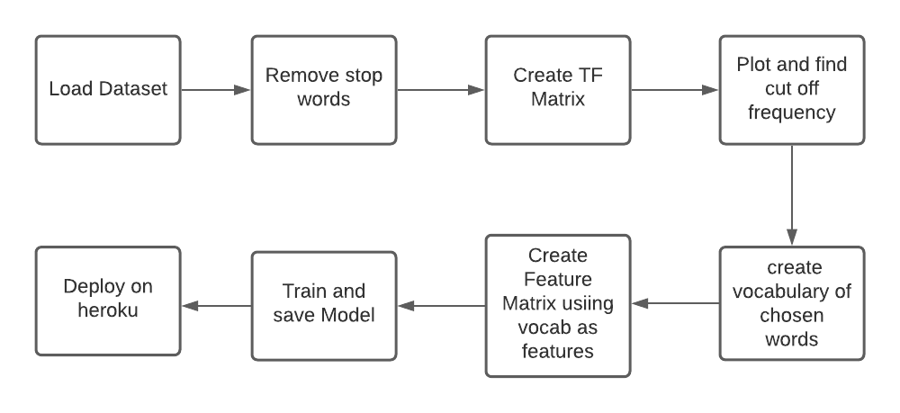
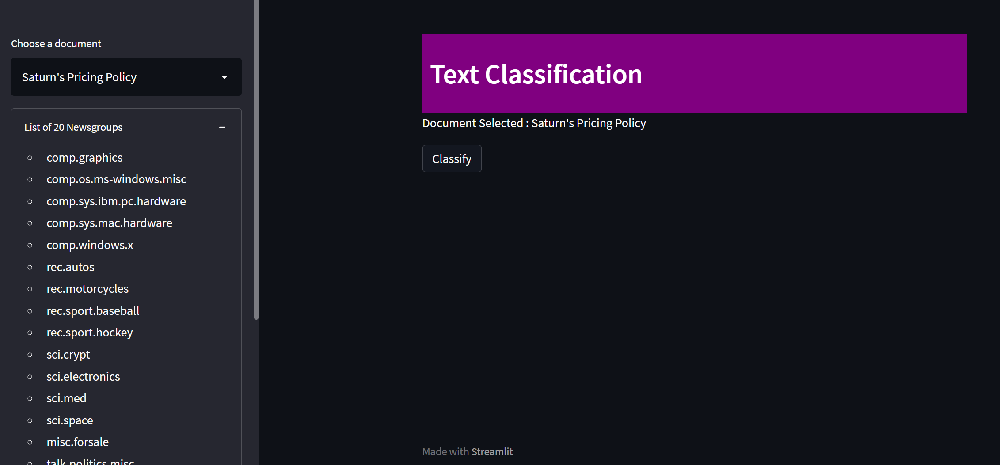
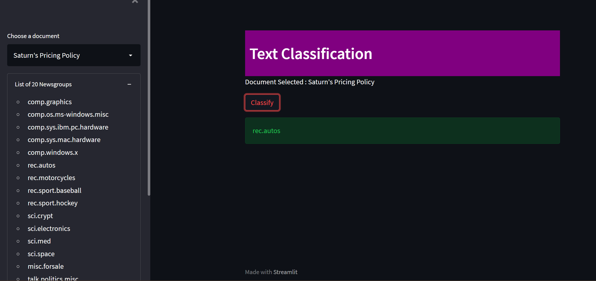

## Naive-Bayes-Classifier
This project is about learning the concept behind Naive Bayes Classifier. I have implemented Naive Bayes from scratch by creating a class containing the fit() & predict() function.
## Dataset
Link : 
## Live App on Heroku

## Flowchart

## Learning
- Build Naive Bayes from scratch.
## Steps followed
  - Built the Feature Matrix from the raw text using Term-Frequency representation.
  - Setting a cut-off and creation of vocabulary of most frequent words.
  - Build a Naïve Bayes Classifier from scratch and compared the result with the inbuilt classifier.
  - ### Accuracy Achieved :
      - Score of inbuilt sklearn model on test data:  0.8612
      - Score of Self implemented model on test data:  0.8602
      
## Screenshots

